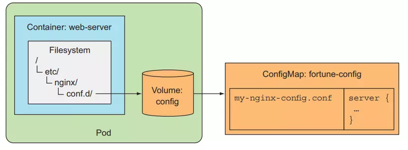

# Configuration in Kubernetes

## ConfigMap

A ConfigMap is an API object used to store non-sensitive configuration data in key-value pairs. It allows you to decouple configuration from your containerized applications, making it easier to manage and update configuration settings without rebuilding the container image.

ConfigMaps can be used to store environment variables, command-line arguments, configuration files, or any other configuration data that your application needs. They can be created manually or from files, directories, or even from other ConfigMaps.

To use a ConfigMap in your application, you can mount it as a volume or inject specific values as environment variables.

## Secret

A Secret is an API object used to store sensitive information, such as passwords, API keys, or TLS certificates, in a secure manner. Secrets are base64-encoded and can be used by applications running in Kubernetes without exposing the actual secret data.

Similar to ConfigMaps, Secrets can be mounted as volumes or injected as environment variables in your application. However, Secrets are encrypted at rest and are only accessible to the pods that have the necessary permissions to access them.

It's important to note that while Secrets provide a level of security, they are not foolproof. It's recommended to follow best practices for securing sensitive information, such as limiting access permissions and rotating secrets regularly.

For more information on how to use ConfigMaps and Secrets in Kubernetes, refer to the official Kubernetes documentation.

## Visualizer

