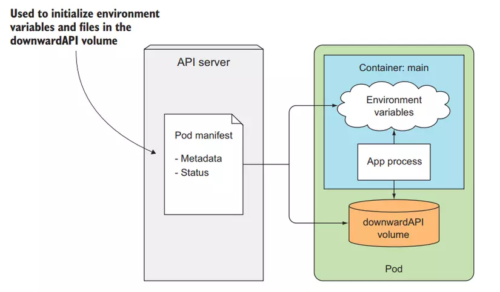
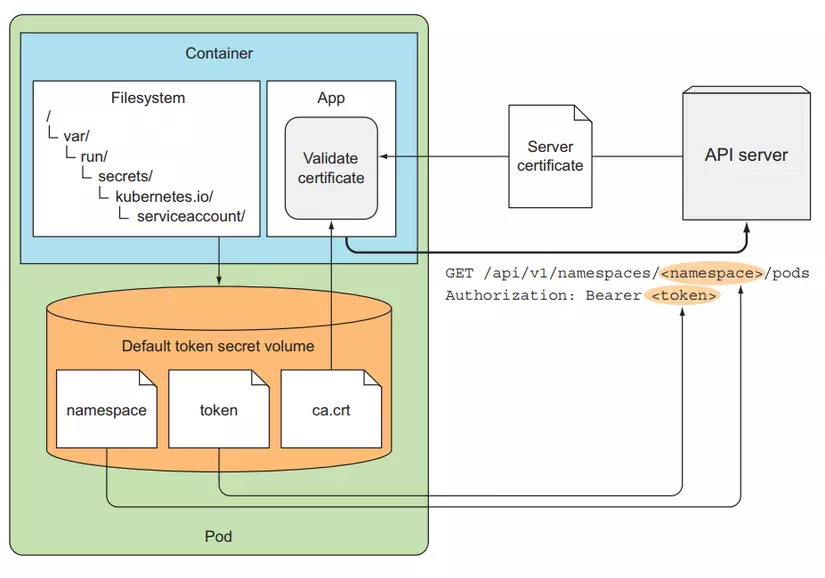

# Downward API in Kubernetes

The Downward API in Kubernetes allows you to expose information about a pod and its containers as environment variables or as files in the pod's filesystem. This information can be useful for configuring and customizing your applications running in Kubernetes.

## Usage

To use the Downward API, you need to define the `downwardAPI` field in the pod's `spec` section of the YAML file. You can specify the information you want to expose as environment variables or as files.

### Exposing information as environment variables

To expose information as environment variables, you can use the `env` field in the `downwardAPI` section. For example, to expose the pod's name and namespace as environment variables, you can add the following to your pod's YAML file:

## Visulizer

| Downward API                                | Kubernetes API                                  |
| ------------------------------------------- | ----------------------------------------------- |
|  |  |

