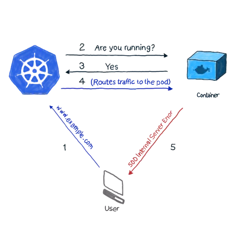

## Kubernetes Pod

A Pod is the smallest and simplest unit in the Kubernetes object model that you create or deploy. A Pod represents a running process on your cluster.

A Pod can contain one or more containers, such as Docker containers. When a Pod runs multiple containers, the containers are managed as a single entity and share the Pod's resources, including the network and storage volumes.

Pods are designed to support co-located (co-scheduled), co-managed helper programs, such as:

- Content management systems, file and data loaders, local cache managers, etc.
- Log and checkpoint backup, compression, rotation, snapshotting, etc.
- Data change watchers, log tailers, logging and monitoring adapters, event publishers, etc.
- Proxies, bridges, and adapters.
- Controllers, managers, configurators, and updaters.

The Pod model provides a higher level of abstraction than the underlying container model and provides features that are necessary for horizontally scaling applications.

## Visualizer

