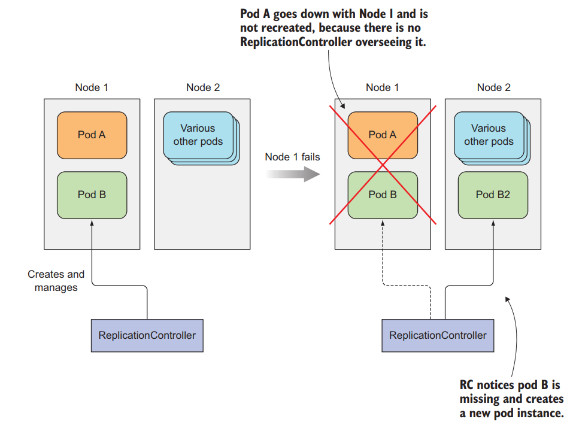

# Kubernetes ReplicationControllers

This repository contains examples and usage of Kubernetes ReplicationControllers.

A ReplicationController ensures that a specified number of pod replicas are running at any given time. In other words, a ReplicationController makes sure that a pod or a homogeneous set of pods is always up and available.

## Why Use ReplicationControllers?

- They can launch a specified number of pods.
- They can automatically replace any pods that fail or are deleted.
- They can scale the number of pods up or down, manually or with auto-scaling.

## Examples

The examples in this repository will help you understand how to create, update, and delete ReplicationControllers.

## Prerequisites

You need to have a Kubernetes cluster, and the kubectl command-line tool must be configured to communicate with your cluster.

## Usage

Each example comes with its own README explaining how to use it.

## Difference between ReplicationControllers and ReplicaSet

While ReplicationControllers and ReplicaSets serve a similar purpose of maintaining a stable set of replica Pods running at any given time, they have some differences:

- **Selector Support**: ReplicaSets support set-based selectors, which allow more flexibility in defining how the controller identifies the Pods it is supposed to manage. On the other hand, ReplicationControllers only support equality-based selectors.

- **Ownership**: ReplicaSets are considered newer and are the preferred way to replicate applications. They are owned by Deployments, which handle updates to Pods and their lifecycle.

- **Versioning**: ReplicationControllers do not support updates to Pods, so changes to the Pod template must be manually rolled out to existing Pods. ReplicaSets, on the other hand, are designed to be used with Deployments to handle updates and versioning of Pods.

Remember, it's generally recommended to use ReplicaSets through Deployments rather than using ReplicaSets directly, as Deployments provide additional features such as rolling updates.

## Visualizer

