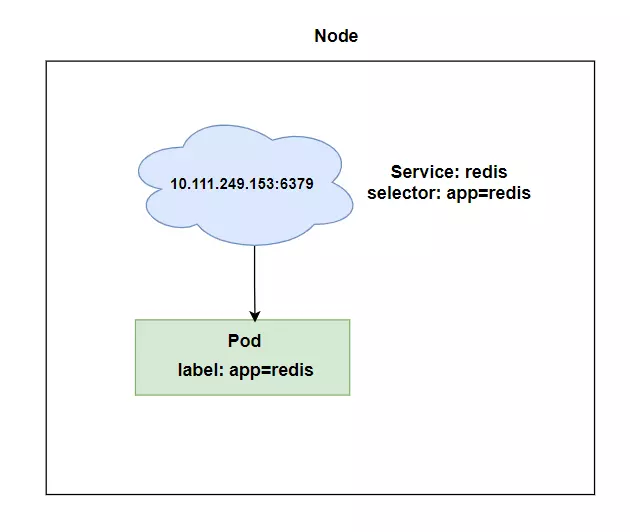

# Kubernetes Service - ClusterIP

In Kubernetes, a `Service` is an abstraction which defines a logical set of Pods and a policy by which to access them. The set of Pods targeted by a Service is usually determined by a `selector`.

`ClusterIP` is one of the serviceTypes in Kubernetes that you can use. By default, if no type is specified, `ClusterIP` is used.

A `ClusterIP` service is the most basic type of service. It gives a service an internal IP address that is accessible within the cluster. It allows your applications to communicate with each other and also balance the load.

Here are some key points about `ClusterIP`:

- ClusterIP exposes services on a cluster-internal IP.
- Selecting this value makes the service only reachable from within the cluster.
- This is the default `ServiceType`.

## Visualizer

