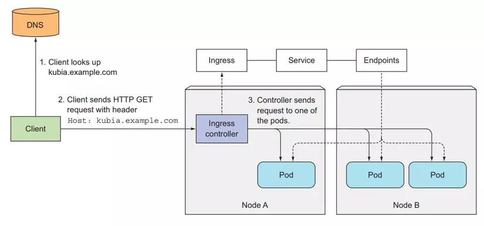

# Ingress in Kubernetes

Ingress in Kubernetes provides HTTP and HTTPS routing to services within a cluster. It allows external traffic to reach internal services based on defined rules, such as host and path-based routing.

## How it works

1. When you create an Ingress resource, Kubernetes uses an Ingress Controller (e.g., NGINX, Traefik) to process incoming requests.

2. The Ingress Controller listens for external requests and routes them to the appropriate backend services based on the configured rules.

3. Ingress can handle TLS termination, reducing the need for individual services to manage SSL certificates.

4. Ingress can also provide features like URL rewriting, load balancing, and authentication handling.

## Benefits

- **Centralized routing**: Manages all external traffic routing in one place.
- **TLS termination**: Handles SSL/TLS encryption centrally, reducing complexity for backend services.
- **Path and host-based routing**: Directs traffic to different services based on request paths or hostnames.
- **Load balancing**: Distributes traffic across multiple backend pods for high availability.

## Usage

To create an Ingress resource in Kubernetes, define a YAML manifest like the following:

```yaml
apiVersion: networking.k8s.io/v1
kind: Ingress
metadata:
  name: k8s-service-ingress
  namespace: default
  annotations:
    nginx.ingress.kubernetes.io/rewrite-target: /
spec:
  ingressClassName: nginx
  rules:
    - host: domain.example.com
      http:
        paths:
          - path: /api
            pathType: Prefix
            backend:
              service:
                name: k8s-pod-backend
                port:
                  number: 8080
          - path: /
            pathType: Prefix
            backend:
              service:
                name: k8s-pod-frontend
                port:
                  number: 3000
  tls:
    - hosts:
        - domain.example.com
      secretName: tls-secret
```

## Visualizer


