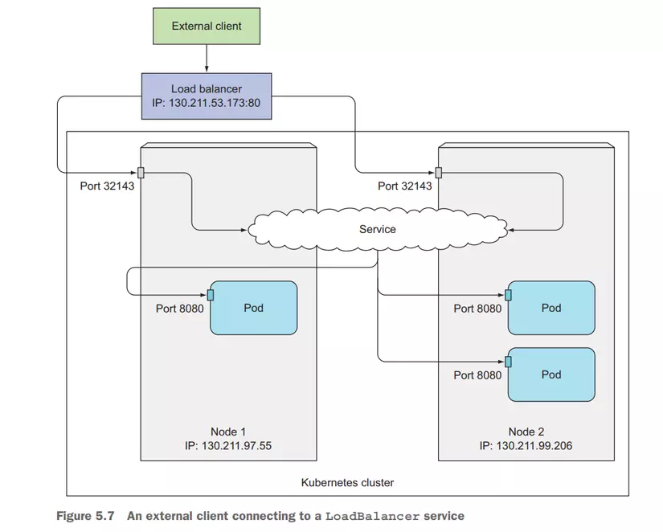

# LoadBalancer Service

The LoadBalancer service in Kubernetes provides a way to expose your application to external traffic by automatically provisioning a cloud load balancer. It distributes incoming traffic across multiple backend pods, ensuring high availability and scalability.

## How it works

1. When you create a LoadBalancer service, Kubernetes requests a load balancer from the cloud provider (e.g., AWS, GCP, Azure).
2. The cloud provider provisions a load balancer and assigns it an external IP address.
3. The load balancer routes incoming traffic to the backend pods associated with the service.
4. Kubernetes continuously monitors the health of the backend pods and updates the load balancer accordingly.

## Benefits

- **External accessibility**: LoadBalancer services allow your application to be accessed from outside the cluster.
- **Automatic load balancing**: Incoming traffic is evenly distributed across backend pods, improving performance and scalability.
- **High availability**: If a backend pod fails, the load balancer automatically routes traffic to healthy pods.
- **Integration with cloud providers**: Load balancers are provisioned and managed by the cloud provider, leveraging their features and capabilities.

## Usage

To create a LoadBalancer service in Kubernetes, you can define a YAML manifest like the following:

## Visualizer

