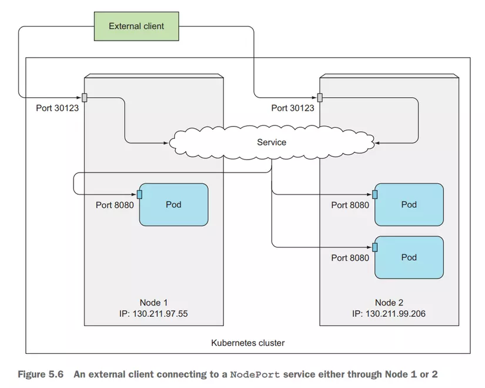

# Kubernetes NodePort Service

In Kubernetes, a `Service` is an abstraction which defines a logical set of Pods and a policy by which to access them. The set of Pods targeted by a Service is usually determined by a selector.

`NodePort` is one type of `Service` that allows for external access to services in the cluster. It opens a specific port on all the Nodes (the VMs), and any traffic that is sent to this port is forwarded to the service.

## How NodePort Works

When a `NodePort` service is created, Kubernetes does the following things:

1. Allocates a port from a range specified by `--service-node-port-range` flag (default: 30000-32767).
2. For each Service Port, it opens the allocated port on every Node and proxies it to the service.
3. The service is accessible through `<NodeIP>:<NodePort>` from outside the cluster.

Remember that using NodePort, your service is accessible through the IP address of your node in the cluster. If your node is destroyed, the IP address is changed, or you have any network policies in place, the service may not be accessible.

## When to Use NodePort

`NodePort` is a simple way to expose your service. It's ideal for development and testing. But for production environments, it might not be the best choice due to the limitations of needing a static IP address and the risk of high port numbers that are often blocked by corporate firewalls.

## Retrieve Worker Node IP

```
$ kubectl get nodes -o wide | awk -v OFS='\t\t' '{print $1, $6, $7}'
$ kubectl get nodes -o yaml | grep addresses: -A 8
```

## Visualizer


