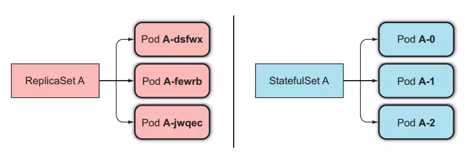
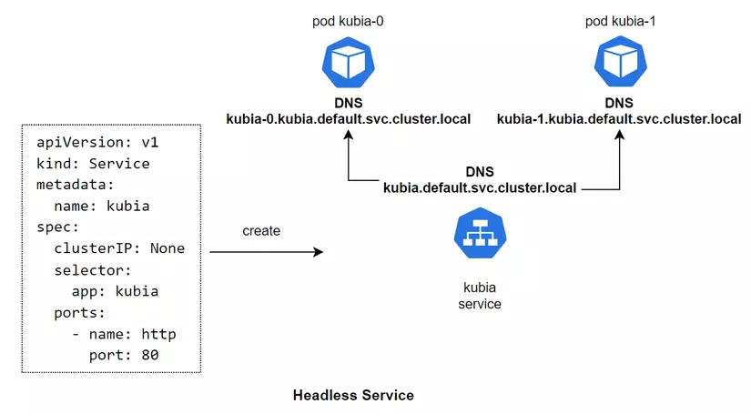

# StatefulSets in Kubernetes

StatefulSets are a powerful feature in Kubernetes that allow you to manage stateful applications. Unlike Deployments, StatefulSets provide stable network identities and persistent storage for each pod in the set. This makes them ideal for applications that require unique network identities or rely on stable storage.

## Key Features

- **Stable Network Identities**: Each pod in a StatefulSet has a stable hostname and network identity, making it easier to communicate with other pods in the set.
- **Ordered and Controlled Deployment**: StatefulSets ensure that pods are deployed and scaled in a predictable and ordered manner, which is crucial for stateful applications.
- **Persistent Storage**: StatefulSets provide persistent storage for each pod, allowing data to be preserved even if a pod is restarted or rescheduled.
- **Scaling and Rolling Updates**: StatefulSets support scaling operations and rolling updates, allowing you to easily manage the lifecycle of your stateful applications.

## Usage

To use StatefulSets in your Kubernetes cluster, you can define a StatefulSet manifest file and apply it using the `kubectl apply` command. The manifest file should include details such as the number of replicas, pod template, and any required persistent volumes.

For more information on how to use StatefulSets, refer to the official Kubernetes documentation: [StatefulSets - Kubernetes Documentation](https://kubernetes.io/docs/concepts/workloads/controllers/statefulset/)

## Visualizer

# Headless Service in Kubernetes

A headless service is a type of service in Kubernetes that does not allocate an IP address to individual pods. Instead, it allows direct communication with the individual pods using their DNS names. This is useful in scenarios where you need to access each pod individually or when you want to implement your own load balancing logic.

### Key Features

- **Direct Pod Communication**: With a headless service, you can communicate directly with individual pods using their DNS names, bypassing the service's IP address.
- **Custom Load Balancing**: Headless services allow you to implement your own load balancing logic, giving you more control over how traffic is distributed to the pods.
- **Pod Discovery**: Headless services provide a way to discover the IP addresses of individual pods, which can be useful for certain applications or debugging purposes.

### Usage

To create a headless service in your Kubernetes cluster, you can define a Service manifest file and set the `clusterIP` field to `None`. This will create a headless service that does not allocate an IP address to the pods.

For more information on how to use headless services, refer to the official Kubernetes documentation: [Headless Services - Kubernetes Documentation](https://kubernetes.io/docs/concepts/services-networking/service/#headless-services)

## Visualizer

