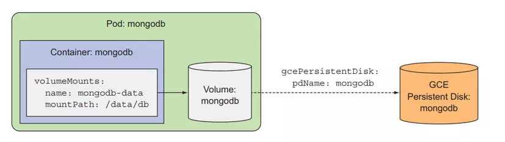

# Kubernetes Cloud Storage Volume

## Overview

A **Cloud Storage Volume** in Kubernetes is a storage solution that allows Pods to store and retrieve data using cloud-based storage services such as **Google Cloud Storage (GCS), Amazon Elastic Block Store (EBS), Azure Disk**, or **NFS** solutions. These volumes provide **persistent storage** that is independent of the lifecycle of Pods and nodes.

## Features of Cloud Storage Volumes

- **Persistent Storage**: Data remains intact even if the Pod is restarted or deleted.
- **Scalability**: Easily scales with cloud provider storage solutions.
- **Multi-Zone Availability**: Data can be replicated across zones for high availability.
- **Access Control**: Integrated with cloud provider IAM policies for security.

## Use Cases

- **Persistent Databases**: Store MySQL, PostgreSQL, or MongoDB data.
- **Log Storage**: Retain application logs for debugging and auditing.
- **File Sharing**: Share files between multiple Pods using a common cloud volume.
- **Backup & Restore**: Easily back up and restore volumes across environments.

## Example Usage

To use a `hostPath` volume, you need to define it in the Pod specification and mount it into one or more containers within the Pod.

### YAML Configuration

```yaml
apiVersion: v1
kind: Pod
metadata:
  name: k8s-volume-cloud-storage
spec:
  containers:
    - image: busybox
      name: k8s-pod
      command: ['/bin/sh', '-c', "echo 'Hello Cloud Storage' > /mnt/data/message && sleep 3600"]
      volumeMounts:
        - mountPath: /mnt/data
          name: k8s-volume-storage
  volumes:
    - name: k8s-volume-storage
      gcePersistentDisk:
        pdName: my-gce-disk
        fsType: ext4
```

## Visualizer

<div align="center">

</div>
