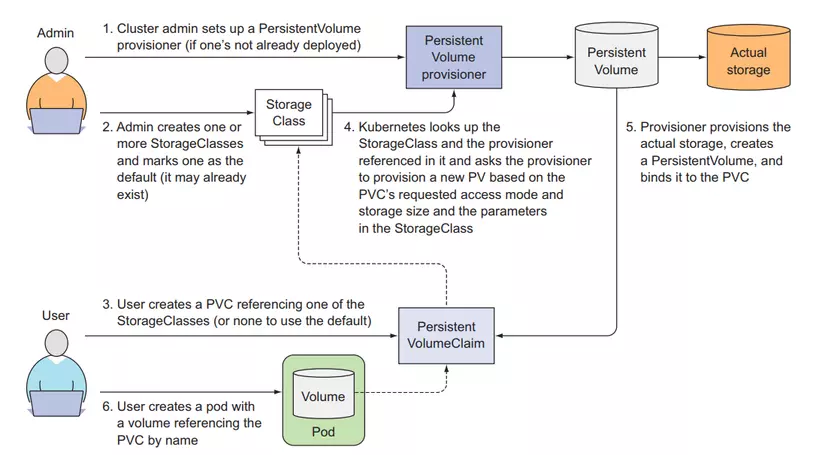

# Kubernetes StorageClass

## Overview

A **StorageClass** in Kubernetes enables dynamic provisioning of Persistent Volumes (PVs) based on predefined storage configurations. It allows administrators to define storage policies and automate PV creation without manual intervention.

## Features of HostPath

- Supports dynamic volume provisioning.
- Defines storage policies such as performance, availability, and backup rules.
- Works with cloud providers (AWS, GCE, Azure) and on-premise storage solutions.
- Allows administrators to specify different storage backends.

## Use Cases

- **Cloud Storage Provisioning**: Automatically create PVs in cloud environments.
- **Different Performance Tiers**: Assign storage based on workload needs (e.g., SSD vs HDD).
- **Multi-tenant Storage Policies**: Define storage rules for different teams or applications.

## Example Usage

### YAML Configuration

```yaml
apiVersion: storage.k8s.io/v1
kind: StorageClass
metadata:
  name: k8s-storage-class
provisioner: kubernetes.io/aws-ebs
parameters:
  type: gp2
```

## Visualizer

<div align="center">

</div>
