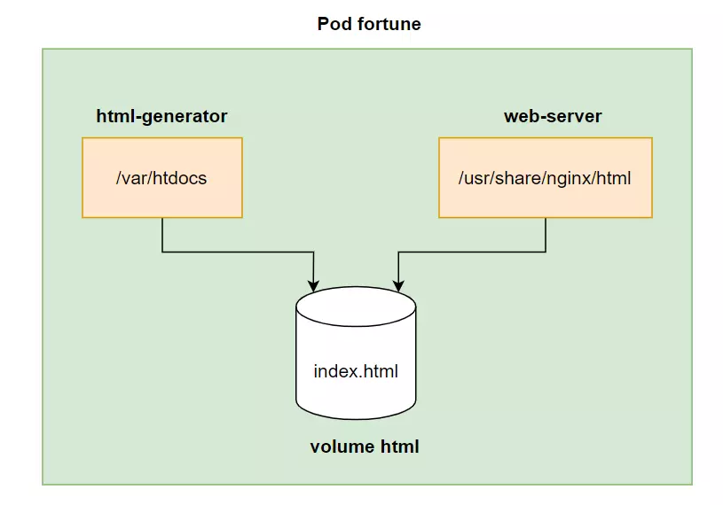

# Kubernetes EmptyDir Volume

## Overview

An `emptyDir` volume in Kubernetes is a temporary storage volume that is created when a Pod starts and deleted when the Pod terminates. This type of volume is useful for sharing data between containers within the same Pod or for caching temporary data that does not need to persist beyond the Pod's lifecycle.

## Features of EmptyDir

- Created when a Pod starts and deleted when the Pod stops.
- Data is shared between all containers in the Pod.
- Storage is backed by the node’s disk (memory-backed storage can be used with medium: Memory).
- Suitable for caching, temporary logs, or shared workspace scenarios.

## Use Cases

- **Cache storage**: Store temporary data that can be accessed across containers.
- **Shared workspace**: Enable inter-container communication using file-based data exchange.
- **Log collection**: Store logs temporarily before pushing them to an external logging service.
- **Memory-backed storage**: Speed up data access by specifying `medium: Memory` for `emptyDir`.

## Example Usage

To use an `emptyDir` volume, you need to define it in the Pod specification and mount it into one or more containers within the Pod.

### YAML Configuration

```yaml
apiVersion: v1
kind: Pod
metadata:
  name: k8s-volume-empty-dir
spec:
  containers:
    - name: k8s-volume-pod-writter
      image: busybox
      command: ['/bin/sh', '-c', "echo 'Hello from writter' > /data/message & sleep 3600"]
      volumeMounts:
        - mountPath: /data
          name: k8s-volume-storage
    - name: k8s-volume-pod-reader
      image: busybox
      command: ['/bin/sh', '-c', 'cat /data/message && sleep 3600']
      volumeMounts:
        - mountPath: /data
          name: k8s-volume-storage
  volumes:
    - name: k8s-volume-storage
      emptyDir: {}
```

## Visualizer


