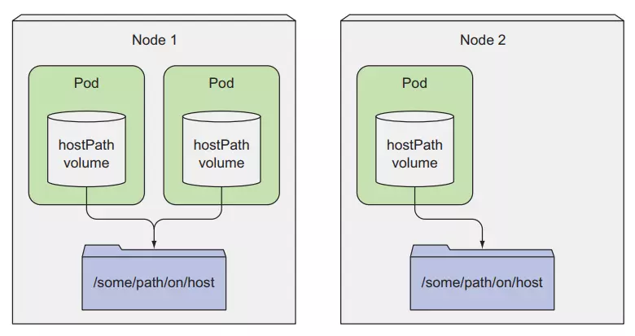

# Kubernetes HostPath Volume

## Overview

A `hostPath` volume in Kubernetes mounts a file or directory from the host node’s filesystem into a Pod. This allows Pods to access or share files on the node where they are running.

## Features of HostPath

- Allows a Pod to access files on the host node.
- Can be used for persistent storage if the Pod is scheduled on the same node.
- Useful for exposing system-level resources to containers.

## Use Cases

- **Accessing host logs**: Share system logs with containers.
- **Persistent storage**: Retain data across Pod restarts (if scheduled on the same node).
- **Configuration files**: Share pre-existing host configurations with containers.
- **System interactions**: Grant containers access to specific host files.

## Example Usage

To use a `hostPath` volume, you need to define it in the Pod specification and mount it into one or more containers within the Pod.

### YAML Configuration

```yaml
apiVersion: v1
kind: Pod
metadata:
  name: k8s-volume-hostpath
spec:
  containers:
    - image: busybox
      name: k8s-volume-pod
      command: ['/bin/sh', '-c', 'cat /data/hostfile && sleep 3600']
      volumeMounts:
        - mountPath: /data
          name: k8s-volume-storage
  volumes:
    - name: k8s-volume-storage
      hostPath:
        path: /mnt/data
        type: DirectoryOrCreate
```

## Visualizer


